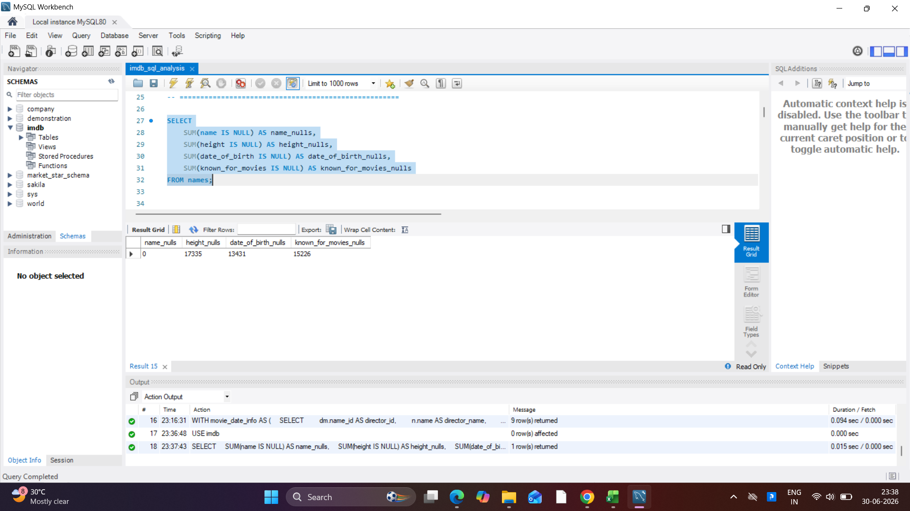
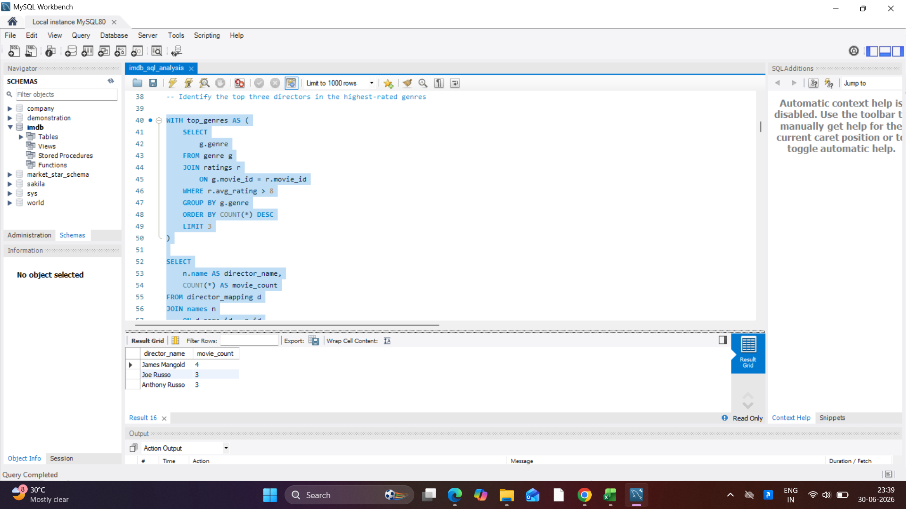
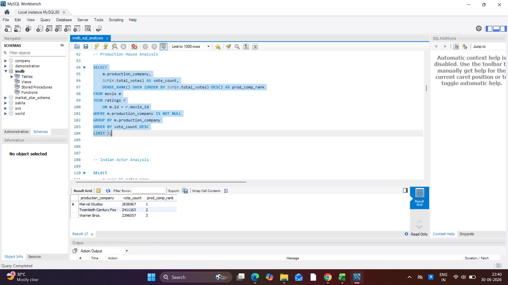
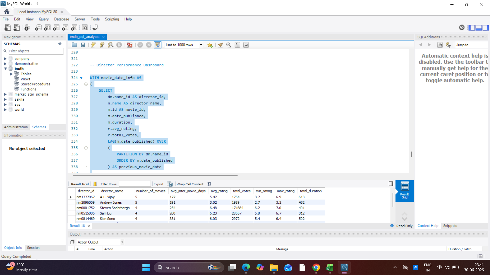

# IMDb SQL Business Analysis

## Project Overview
This project analyzes the IMDb dataset using SQL to generate business insights.

## Tools Used
- MySQL
- MySQL Workbench

## SQL Concepts
- Joins
- CTEs
- Window Functions
- Aggregate Functions
- CASE Statements

## Key Analysis
- Data Quality Assessment
- Director Performance Analysis
- Actor Performance Analysis
- Production House Analysis
- Indian Actor Analysis
- Hindi Actress Analysis
- Thriller Movie Classification
- Genre Duration Analysis
- Highest Grossing Movies Analysis
- Multilingual Movies Analysis
- Drama Actress Analysis
- Director Performance Dashboard

## Project Screenshots

### Data Quality Assessment

### Director Performance Analysis

### Production House Analysis

### Director Performance Dashboard

